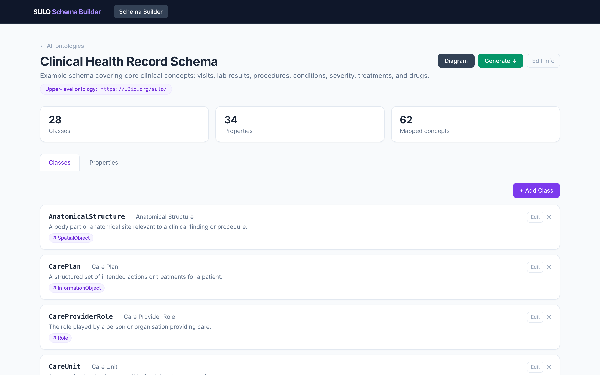
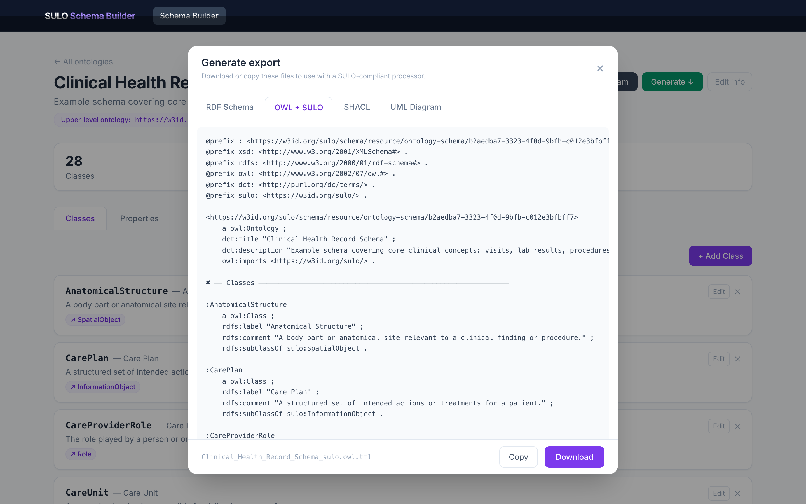

# SULO-Compliant Schema Builder: a web-based tool bridging domain schemas with ontologies using SULO

**Remzi Celebi¹, Catalina Martínez-Costa, Stefan Schulz, Michel Dumontier¹**

¹ Institute of Data Science, Maastricht University, Maastricht, The Netherlands

---

## Abstract

**Background:** Experts who design biomedical data schemas such as HL7 FHIR, OMOP CDM, or relational databases, and ontologists who formalise domain semantics in OWL operate with fundamentally different representational commitments. Existing tools address one community or the other but not both simultaneously, creating a persistent gap between schemas and formally grounded ontologies.

**Findings:** We present the SULO-Compliant Schema Builder, an open-source web application that enables domain experts to define classes and properties, align them interactively to the Simplified Upper-Level Ontology (SULO), and automatically generate four artefacts from a single schema model: plain RDF/Turtle, OWL DL with SULO-compliant equivalence axioms and property restrictions, SHACL node shapes, and Mermaid UML diagrams. A declarative mapping-pattern mechanism, analogous to SPARQL triple templates, compiles domain relations into SULO relations without requiring the user to author OWL directly. A clinical health record case study, covering 32 classes and 41 properties, demonstrates the practical viability of the approach.

**Conclusions:** The SULO-Compliant Schema Builder lowers the barrier between schema design and formal ontology engineering. By embedding upper-ontology alignment and mapping patterns as first-class design features, it makes OWL DL expressivity accessible to practitioners without description-logic expertise, and provides a concrete pedagogical instrument for demonstrating what formal ontologies add over schemas. The tool is freely available at https://github.com/MaastrichtU-IDS/sulo-schema-builder.

**Keywords:** ontology alignment; upper-level ontology; SULO; SHACL; OWL DL; RDF schema; mapping patterns; FHIR; OMOP; schema design

---

## Introduction

The biomedical informatics landscape is populated by well-established data standards — HL7 FHIR [1], OMOP CDM [2], openEHR, HL7 v2 — designed by experts who think in terms of tables, resources, and attributes rather than description-logic axioms. In parallel, the ontology community has invested decades in constructing upper-level frameworks — the Basic Formal Ontology (BFO) [3], DOLCE [4], and the Simplified Upper-Level Ontology (SULO) [5] — that provide principled, interoperable grounding for domain entities by upper-level categories. The gap between these two worlds is well-documented [6, 7]: schema designers regard ontologies as unnecessarily complex, while ontologists find flat schemas semantically impoverished and ambiguous. Schema designers tailor data structures for specific use cases without committing to the ontological characteristics of the entities those structures refer to, whereas ontologists, concerned primarily with those characteristics, tend to be indifferent to the data structures.

Several tools have attempted to narrow this gap from different angles. LinkML [8] provides a YAML-based schema language that compiles to OWL, SHACL, JSON Schema, and SQL from a single source, but requires command-line tooling and produces only basic OWL class mappings rather than full property-restriction chains. Chowlk [9] converts UML diagrams drawn in diagrams.net into OWL Turtle, but is a one-directional converter rather than an interactive designer. model2owl [10] transforms UML XMI models into OWL and SHACL for institutional publishing frameworks. Astrea [11] automatically generates SHACL shapes from existing OWL ontologies. Protégé [12], the leading desktop ontology editor, supports full OWL DL authoring but requires ontology expertise and provides no integrated schema-design workflow or live upper-ontology alignment. None of these tools provides an integrated, browser-based environment that combines (a) interactive schema design, (b) live upper-ontology class and relation alignment with SPARQL autocomplete, (c) OWL DL export with formal axioms derived from per-property mapping patterns, and (d) SHACL export with union-range support — all from a single coherent model.

Here we present the SULO-Compliant Schema Builder, an open-source web application that addresses this gap. The tool is motivated by three design objectives: (i) to bridge RDF schemas and formal OWL ontologies through guided upper-ontology alignment without requiring OWL expertise; (ii) to enable declarative mapping patterns supporting bidirectional transformation between clinical data standards such as SPHN and OMOP and a shared upper-level model; and (iii) to serve as a pedagogical instrument that makes the expressive advantages of formal ontologies tangible to practitioners fluent in schemas but unfamiliar with OWL and with ontology-driven domain analysis independent of data-structure and use-case requirements.

The tool enables researchers and knowledge engineers to define domain-specific classes and properties and align them with corresponding SULO concepts and relations, without requiring modifications to the underlying instance-level data (ABox). Users begin by specifying the classes and properties of their custom schema. Each class is mapped to a relevant SULO ontological category, while properties — which in standard database schemas typically carry only domain and range constraints — are enriched into fuller semantic structures. This mapping is guided by a pattern-based mechanism analogous to SPARQL triple patterns: rather than representing a relationship as a simple subject–property–object triple, the tool "unfolds" each relation into a more descriptive subgraph using reserved placeholders (`?this` and `?value`) to denote the original subject and object. For instance, a property such as *has healthcare provider* can be expressed as a SULO-compliant subgraph in which a clinical visit is modelled as a process involving a participant bearing a designated provider role; that subgraph requires no relations beyond the SULO object properties `has-participant` and `has-feature`.

From a single schema configuration, the tool produces complementary outputs: a standard RDF schema capturing basic class hierarchies and property domain/range declarations, and a SULO-aligned OWL ontology incorporating complex class expressions and property restrictions that enable formal logical reasoning and systematic error detection. Both outputs are exportable as standard ontology files compatible with editors such as Protégé. The tool is openly accessible on GitHub, ensuring reproducibility and supporting broader adoption across research communities working with semantic data integration.

---

## Design and Implementation

### System architecture

The Schema Builder is a three-tier web application (Fig. 1). The frontend is a React single-page application (Vite / Tailwind CSS / React Flow) communicating with a Fastify 5 / TypeScript REST API via `/api/v1` endpoints. The API issues SPARQL 1.1 UPDATE and SELECT queries to a QLever [13] triplestore. All schema data are stored as RDF triples under the namespace `https://w3id.org/sulo/schema/`. Because the storage layer uses only standard SPARQL 1.1, any compliant triplestore can serve as the backend.

> **Fig. 1.** Three-tier architecture of the SULO-Compliant Schema Builder. The browser-based React SPA communicates with a Fastify REST API, which in turn issues SPARQL queries to a QLever triplestore storing all schema artefacts as RDF.

### Data model

A **Schema** contains an ordered set of **Classes** and **Properties**. Each Class carries: (i) a local name used as the IRI fragment (e.g. `:ClinicalVisit`); (ii) a human-readable label and description; (iii) an optional `mapsToConceptIri` pointing to the aligned upper-ontology concept (e.g. `https://w3id.org/sulo/Process`); and (iv) an optional `superClassId` for intra-schema inheritance expressed as `rdfs:subClassOf`. Each Property carries: a name, label, and type (object or datatype); a domain class and range class (or XSD datatype for datatype properties); an `isRequired` flag; and a **mapping pattern** — a list of `TripleTemplate` objects, each comprising a subject variable, a predicate IRI, and an object (either a variable or an IRI constant).

### The mapping process

The mapping process aligns a custom data schema with SULO without requiring changes to the underlying instance-level data (ABox). It proceeds as follows:

1. **Class mapping.** Domain-specific classes (e.g. clinical visit, person, device) are mapped to their corresponding upper-level superclasses within the SULO hierarchy.
2. **Property mapping.** Domain relationships (e.g. `hasPatient`, `hasHealthcareProvider`) are transformed into detailed semantic structures using mapping patterns. Rather than a simple subject–object link, each relation is "unfolded" into a descriptive subgraph using two placeholders: **`?this`** (the subject of the original property) and **`?value`** (the object or range).

For example, the property `hasPatient` on `ClinicalVisit` can be expressed with the three-hop SULO role-bearer pattern:

```
?this  sulo:hasParticipant  ?role
?role  rdf:type             :SubjectOfCareRole
?role  sulo:isFeatureOf     ?value
```

The `buildOwlExpr` compiler performs a recursive descent over the pattern, treating each triple template as a directed graph edge. Starting from `?this` (the domain class), it: (i) collects all triples with the current variable as subject; (ii) for `rdf:type` triples with a constant object, adds the type as an `owl:intersectionOf` member; (iii) for triples whose object is `?value`, emits an `owl:someValuesFrom` restriction pointing at the range class; and (iv) for triples whose object is another variable, recurses to build a nested restriction. The pattern above compiles to:

```turtle
_:domain_hasPatient owl:equivalentClass [
  a owl:Class ;
  owl:intersectionOf (
    :ClinicalVisit
    [ a owl:Restriction ;
      owl:onProperty sulo:hasParticipant ;
      owl:someValuesFrom [
        a owl:Class ;
        owl:intersectionOf (
          :SubjectOfCareRole
          [ a owl:Restriction ;
            owl:onProperty sulo:isFeatureOf ;
            owl:someValuesFrom :Person ]
        )
      ]
    ]
  )
] .
```

This restriction formally captures the SULO role-bearer pattern in full description logic and defines the domain restriction for the `hasPatient` relation; a similar restriction is generated for the range. Crucially, the user authored only a triple-template form in the browser — no OWL axiom was written by hand. The companion function `buildReverseOwlExpr` performs the same traversal in the inverse direction, emitting `owl:inverseOf` restrictions, enabling the same pattern list to support both forward and reverse SPARQL-based queries.

### Export pipeline

From a single schema configuration, the tool generates four complementary artefacts:

- **Plain RDF/Turtle.** An RDFS vocabulary defining `owl:Class` hierarchies, `rdfs:label`, `rdfs:comment`, `rdfs:domain`, and `rdfs:range`. This is the schema view familiar to linked-data practitioners and readable without OWL knowledge.
- **OWL + SULO.** Extends the plain export with `owl:equivalentClass` axioms for every class with a `mapsToConceptIri` and with nested `owl:someValuesFrom` restrictions compiled from the mapping patterns. Union ranges generate `owl:unionOf` constructs. External concept IRIs (e.g. SNOMED CT) are referenced by full IRI rather than local prefix.
- **SHACL.** One `sh:NodeShape` per class, using schema-native predicates as `sh:path` values. Union ranges generate `sh:or` blocks; required properties carry `sh:minCount 1`. Shapes are intentionally free of SULO predicates so they validate instance data expressed in the schema's own vocabulary, not upper-ontology paths.
- **Mermaid UML.** A `classDiagram` in Mermaid syntax, suitable for embedding in GitHub Markdown or mermaid.live, with inheritance and association arrows rendered appropriately.

The key advantage of this approach is that researchers can switch between a simple schema-based representation and a highly expressive SULO-based one — enabling controlled comparisons for tasks such as error detection and neural-network performance evaluation — without manually converting any underlying database records.

### User interface

The GUI bridges schema design and ontology authoring through two principal mechanisms.

**Alignment with upper-level ontologies.** When adding or editing a property, the user types a mapping pattern that unfolds the relation by bridging the domain class (`?this`) to the range class (`?value`). Each class shows its SULO category as an inline badge (Fig. 3).



> **Fig. 3.** Builder view — classes aligned to SULO categories with inline badges; the header summarises class, property, and mapped-concept counts.

**Export tabs.** The export modal displays the plain RDF Schema, OWL + SULO, SHACL, and UML representations, making the provenance of each formal axiom directly traceable to a specific schema design choice (Fig. 4).



> **Fig. 4.** Export modal — the OWL + SULO tab showing prefix declarations and `owl:equivalentClass` restrictions derived from the mapping patterns.

---

## Use Cases and Evaluation

### Clinical health record case study

To evaluate the tool's practical viability, we constructed a Clinical Health Record Schema modelling a representative subset of the domain and inspired by the SPHN schema [14]. The schema, loadable via the **Load Example** button, comprises:

- **32 classes** — 30 aligned to SULO concepts (Process ×8, SpatialObject ×8, InformationObject ×5, Role ×5, Quality ×3, Quantity ×1) and 2 aligned to SNOMED CT URIs (`ObservableEntity`: `http://snomed.info/id/363787002`; `SCT_Procedure`: `http://snomed.info/id/71388002`).
- **41 properties** — 33 object properties linking schema classes and 8 datatype properties mapping to XSD literals; every property carries a SULO mapping pattern (concept links via `sulo:hasFeature`, role-mediated participation via `sulo:hasParticipant`, timestamps via `sulo:atTime`, etc.).
- **5 subclass relationships** — `MeasurementProcess`, `EvaluationProcess`, and `MedicationAdministration` as subclasses of `MedicalProcedure`; `ObservableEntity` and `SCT_Procedure` as subclasses of `Code`.
- **4 classes adopted from the SPHN schema** — `AdministrativeCase` (a `Process` grouping a patient's visits), `Sample` and `Substance` (`SpatialObject`s), and `DrugPrescription` (an `InformationObject`) — illustrating cross-schema reuse of upper-level-aligned concepts.

The OWL DL export for this schema generates 67 `owl:equivalentClass` axioms (with their property restrictions) from the mapping patterns. The SHACL export generates 32 node shapes with 39 property shapes, 2 of which contain `sh:or` union ranges. Running the integrated consistency check, HermiT reports the schema **coherent** — no unsatisfiable classes — confirming that every class–property alignment respects SULO's category, domain/range, and parthood constraints.

### Consistency checking

The builder exposes a one-click **Check consistency** action that runs a full OWL DL reasoner over the schema without leaving the editor. It submits the generated OWL + SULO artefact to a backend service, which merges it with the complete SULO ontology and invokes HermiT (via ROBOT) to compute two verdicts: whether the merged ontology is *consistent* — has a model at all — and which classes are *unsatisfiable* — can have no instances even when the ontology is otherwise consistent. The result is returned as a list of clashes, each naming the offending class or individual together with the reasoner's explanation (the minimal set of axioms that entails the contradiction), and rendered as a single ✓ or an annotated problem list. Because an unsatisfiable class follows from the schema axioms alone, modelling errors are caught at design time, before any instance data exists; once data is added, an individual forced into an empty class renders the whole graph inconsistent. The check runs server-side, since it requires a JVM-based reasoner, and reasons over the full OWL DL semantics of the generated axioms — strictly more than the shape validation SHACL provides. The next section illustrates the error categories it surfaces.

### Detecting modelling errors

A principal advantage of aligning a domain schema to SULO and generating OWL DL artefacts is that a description-logic reasoner can detect modelling errors invisible to schema validators and SHACL engines. SULO declares four top-level categories — `Capability`, `InformationObject`, `Quality`, and `Role` — as mutually disjoint via `owl:AllDisjointClasses`, and additionally asserts that `Object` and `Process` are disjoint. Beyond category disjointness, SULO also constrains how its relations may be used: `sulo:hasValue` and `sulo:refersTo` have an `InformationObject` domain, `sulo:hasParticipant` a `Process` domain, and `sulo:hasPart` propagates a category to its parts (`Process ⊑ ∀hasPart.Process`, and analogously for `Object`, `InformationObject`, and `SpatialObject`). Any instance datum or class axiom that violates these constraints produces an unsatisfiable class or a direct contradiction, surfaced as a reasoner clash and reported directly in the tool's integrated *Consistency* check. The examples below illustrate the recurring error categories with realistic modelling mistakes that arise when generating RDF from clinical sources: Examples 1–2 stem from category disjointness made explicit through instance typing and class subsumption; Examples 3–6 from relations and parthood mappings that force an entity into a second, incompatible category; and Examples 7–8 from finer category distinctions — separating a quantity from a quality, and a role from its bearer. In each case the conflict is logical rather than structural, surfaced by reasoning over the generated OWL (the tool's integrated consistency check) rather than by shape validation.

**Example 1 — conflating a statement with a quality.** The following instance, generated from the text *"Acute viral pharyngitis with mild severity"*, assigns two types to a single individual:

```turtle
ex:pharyngitis_severity_conflation
  a chr:DiagnosticStatement, chr:Severity ;
  rdfs:label "Acute viral pharyngitis with mild severity" ;
  chr:hasCode <http://snomed.info/id/195662009> .
```

The schema alignments establish that `chr:DiagnosticStatement` maps to `sulo:InformationObject` and `chr:Severity` maps to `sulo:Quality`. SULO declares these categories mutually disjoint:

```turtle
owl:AllDisjointClasses (
  sulo:Capability  sulo:InformationObject
  sulo:Quality     sulo:Role
) .
```

A full OWL DL reasoner such as HermiT or Pellet detects this clash and warns the user.

**Example 2 — conflating a condition with the observation about it.** A structurally common error in deployed clinical information models is conflating a clinical *condition* with the *observation* about that condition. While the distinction is well understood in principle — a clinical condition is a pathological process in the patient, whereas an observation is an information object that refers to that process — it is routinely violated in the data structures of widely used terminologies and record models. The following class definition mixes them by placing a single class under both:

```turtle
ex:ClinicalFinding
  rdfs:subClassOf chr:Observation ,        # chr:Observation        → sulo:InformationObject
                  chr:ClinicalCondition .  # chr:ClinicalCondition  → sulo:Process
```

Any instance of `ex:ClinicalFinding` would simultaneously be a `sulo:Object` (via `InformationObject`) and a `sulo:Process`, two categories that SULO declares pairwise disjoint. The class is therefore unsatisfiable, and every individual typed as `ex:ClinicalFinding` immediately fires a clash. This example has particular educational value: it highlights the phenomenon of a representational use–mention confusion, exposing a category mistake at the schema level and making the distinction between referent and representation explicit and machine-verifiable.

**Example 3 — a record made part of the process it documents.** A `chr:Diagnosis` is correctly aligned to `sulo:InformationObject`: it is a statement *about* a clinical situation, not the situation itself. To link each diagnosis to the hospital stay it was recorded during, the schema author maps the `hasAdministrativeCase` relation onto SULO's parthood relation `sulo:isPartOf`:

```turtle
chr:Diagnosis           rdfs:subClassOf sulo:InformationObject .
chr:AdministrativeCase  rdfs:subClassOf sulo:Process .

# hasAdministrativeCase compiled as:  ?this sulo:isPartOf ?case
ex:diagnosis_9 a chr:Diagnosis ;
  sulo:isPartOf ex:case_2 .
ex:case_2 a chr:AdministrativeCase .
```

`sulo:isPartOf` is the inverse of `sulo:hasPart`, so this entails `ex:case_2 sulo:hasPart ex:diagnosis_9`. The administrative case is a `sulo:Process`, and SULO constrains `sulo:Process ⊑ ∀sulo:hasPart.Process` — every part of a process is itself a process. The diagnosis is therefore forced to be a `Process`; but it was declared an `InformationObject ⊑ sulo:Object`, and `sulo:Object owl:disjointWith sulo:Process`, so `ex:diagnosis_9` would be at once an `Object` and a `Process`, and the reasoner reports an inconsistency. The mistake is a parthood variant of *use–mention* confusion: a diagnosis *record* is not a temporal part of the encounter it documents. Its link to the case is an association, not mereology, and is properly expressed with the unconstrained `sulo:isIn` relation rather than `sulo:isPartOf` — making the distinction between a process in reality and a statement recorded about it explicit and machine-verifiable.

The next six examples extend the same principle to the *relations* a schema attaches to its classes. Each arises naturally when a tabular source (e.g. OMOP CDM or SPHN) is mapped to SULO column by column, and each is invisible to SHACL because no asserted shape is violated — the conflict is in the logic.

**Example 4 — a literal value on a process.** A frequent shortcut when flattening a drug-exposure row is to attach each scalar column directly to the event:

```turtle
ex:drug_exposure_42 a chr:DrugAdministration ;
  chr:daysSupply "30"^^xsd:integer .
```

`chr:DrugAdministration` maps to `sulo:Process`, and `chr:daysSupply` compiles to the pattern `?this sulo:hasValue ?value`. Since `sulo:hasValue rdfs:domain sulo:InformationObject`, the subject of any `hasValue` assertion is inferred to be an `InformationObject` (hence a `sulo:Object`); but the event is a `sulo:Process`, and `Object owl:disjointWith Process`. The reasoner reports the property's domain as unsatisfiable: a process cannot itself carry a literal value. The coherent pattern — used by every date-time column — routes the literal through an information-bearing node (`?this sulo:atTime [ a sulo:TimeInstant ; sulo:hasValue ?value ]`), where `hasValue` sits on the `TimeInstant`, an `InformationObject`.

**Example 5 — an information object given a participant.** A measurement result — an information object recording a value — is assigned a patient through the participant pattern:

```turtle
ex:measurement_7 a chr:Measurement ;
  chr:hasSubject ex:patient_3 .
```

`chr:Measurement` maps to `sulo:InformationObject`, and `chr:hasSubject` compiles to `?this sulo:hasParticipant [ a chr:SubjectRole ; sulo:isFeatureOf ?value ]`. SULO declares `sulo:hasParticipant rdfs:domain sulo:Process`: only a process has participants. The result is therefore forced to be a `Process`, contradicting its `Object` membership. The mistake is a category error between the measuring *process* — which legitimately has the patient as a participant — and the measurement *result*, an information object that merely records it; the fix attaches the patient to the underlying process, or states that the result `sulo:refersTo` the patient.

**Example 6 — a part drawn from the wrong category.** Modelling a drug dose as a structural part of the administration process:

```turtle
ex:drug_exposure_42 a chr:DrugAdministration ;
  sulo:hasPart ex:dose_5 .
ex:dose_5 a chr:DoseQuantity .
```

`chr:DrugAdministration` maps to `sulo:Process`, and SULO constrains `sulo:Process ⊑ ∀sulo:hasPart.Process`: every part of a process is itself a process. But `chr:DoseQuantity` maps to `sulo:Quantity ⊑ sulo:InformationObject ⊑ sulo:Object`. Propagating the universal restriction onto the filler forces `ex:dose_5` to be both a `Process` and an `Object`, which are disjoint, so the class is unsatisfiable. Crucially, this contradiction lives inside an `owl:allValuesFrom` restriction body rather than in a named-class axiom — so unlike Examples 1–2 it escapes both SHACL and lightweight named-class reasoning, and is reached only by a full DL reasoner. A dose is better modelled as a feature of the exposure (`sulo:hasFeature`) than as a part of the process.

**Example 7 — quantifying a quality (age).** It is tempting to model a patient's age as an intrinsic *quality* of the person, and then to record the number directly on it:

```turtle
chr:Age rdfs:subClassOf sulo:Quality .

ex:age_1 a chr:Age ;
  sulo:hasValue "45"^^xsd:decimal .
```

`chr:Age` maps to `sulo:Quality`, which is fine on its own. But the moment a value is attached, the second axiom bites: `sulo:hasValue rdfs:domain sulo:InformationObject`, so `ex:age_1` — being the subject of a `hasValue` assertion — is inferred to be an `InformationObject`. SULO declares `Quality` and `InformationObject` to be disjoint kinds of `Feature`, so `ex:age_1` is simultaneously a `Quality` and an `InformationObject`: a contradiction the reasoner reports as an inconsistency. The clash pinpoints the real distinction — a quality such as "frail" is borne directly and carries no magnitude, whereas anything that *has a value* is information: here a `Quantity` (specifically a `Duration`, the time elapsed since birth) and therefore an `InformationObject`. Age should be modelled as a `sulo:Quantity` related to the person, where the value and its unit properly belong; the same correction applies to body temperature, blood pressure, and any other quantified observation that feels like a property but is in fact recorded information.

**Example 8 — conflating a role with its bearer.** When a schema models the *patient* as a kind of person rather than as a role a person plays, it places one class under two SULO categories at once:

```turtle
chr:Patient rdfs:subClassOf sulo:SpatialObject, sulo:Role .
```

A person is a `sulo:SpatialObject`; the patient *role* is a `sulo:Role`, which SULO makes `⊑ sulo:Feature`. But SULO asserts `sulo:Feature owl:disjointWith sulo:SpatialObject` — features (capabilities, qualities, roles, information objects) are categorically distinct from the spatial objects that bear them. `chr:Patient` is therefore unsatisfiable: nothing can be at once a spatial object and a role. The error, and its remedy, make explicit a distinction clinical schemas routinely blur — the persistent *person* (a `SpatialObject`) versus the context-dependent *subject-of-care role* they play during a particular encounter, which belongs in a separate `sulo:Role` class linked to the person through `sulo:isFeatureOf`. The same diagnosis surfaces wherever a schema treats provider, specimen-donor, or device-operator as a subtype of person rather than as a role.

Together these examples show that SULO alignment turns a broad spectrum of schema-design mistakes — miscategorised entities, misused relations, mislocated parts, quantities mistaken for qualities, and conflated roles and bearers — into machine-checkable logical contradictions that schema validators and SHACL cannot detect, but that the tool's integrated reasoner surfaces directly.

### Mapping patterns as pivot bridges for cross-standard transformation

The pivot approach is enabled by the bidirectional mapping-pattern compiler. The `buildReverseOwlExpr` function traverses the same triple-template list in the inverse direction, emitting `owl:inverseOf` restrictions. Given the SULO representation of a patient person, the reverse function expresses "an individual is a `SubjectOfCareRole` if it is the inverse-participant of a `ClinicalVisit`" — precisely what is needed to query all visits associated with a given patient IRI. SULO thus acts as a pivot model between FHIR, OMOP, and other clinical standards through shared pattern semantics.

### Educational application

The Schema Builder also serves as a pedagogical instrument for demonstrating what formal ontologies add over lightweight schemas. Three comparison points are particularly effective:

- **Structural vs. semantic subsumption.** In the plain Turtle output, `:MeasurementProcess rdfs:subClassOf :MedicalProcedure` is a structural assertion. In the OWL + SULO export, both classes carry `owl:equivalentClass sulo:Process`, making their shared nature machine-inferrable: a reasoner can deduce that a `MeasurementProcess` individual is a `sulo:Process` even without the local class hierarchy.
- **Role indirection.** A schema designer's first instinct is `:ClinicalVisit :hasPatient :Person`. The OWL + SULO export adds the intermediate `SubjectOfCareRole` class, motivated concretely: if a person is the primary responsible contact in visit A but merely an observer in visit B, an intermediate participation node is needed to represent each role distinctly.
- **Constraint expressivity.** SHACL shapes validate that every `Measurement` has a `:hasCode` property pointing to a `:Code` or `:ObservableEntity` instance. The OWL DL equivalence axioms additionally assert, via the `sulo:hasFeature` path, that any individual reached that way from a `sulo:InformationObject` is a `Code` instance. A reasoner materialising the SULO graph can detect inter-dataset type inconsistencies invisible to SHACL; switching between export tabs makes this difference concrete.

A pre-built Clinical Health Record Schema (32 classes, 41 properties) is available via **Load Example**, enabling instructors to demonstrate the full export pipeline without students constructing a schema from scratch. A second **Load OMOP Example** option loads a parallel schema covering the same clinical domain in a different structural style, enabling side-by-side comparison.

### Comparison with related tools

| Tool | Visual GUI | ULO Alignment | OWL Restrictions | SHACL Union Ranges |
|------|:----------:|:-------------:|:----------------:|:------------------:|
| OWLGrEd [15] | ✓ | ✗ | ✓ | ✗ |
| LinkML [8] | ✗ | ✗ | partial | beta |
| Chowlk [9] | ✓ | ✗ | ✓ | ✗ |
| **SULO Schema Builder** | **✓** | **✓** | **✓** | **✓** |

> **Table 1.** Comparison with the most relevant related tools. Only the SULO Schema Builder combines interactive visual design, live upper-level-ontology alignment, OWL DL restriction export, and SHACL union ranges in a single browser-based workflow.

---

## Conclusions

The SULO-Compliant Schema Builder is an open-source web application that bridges the persistent gap between domain schema designers and formal ontology engineering. By embedding upper-ontology alignment and property-level mapping patterns as first-class features of the schema-authoring workflow, the tool transforms ontology construction from a specialist activity requiring description-logic expertise into a guided, form-based process accessible to clinical data managers and domain experts.

The tool makes three concrete contributions. First, the two-layer export architecture produces both a plain RDFS vocabulary and an OWL DL ontology with full `owl:equivalentClass` restrictions from the same schema model, with no OWL authoring required. Second, the bidirectional mapping-pattern compiler (`buildOwlExpr` / `buildReverseOwlExpr`) enables SULO to act as a pivot model between FHIR, OMOP, and other clinical standards through shared pattern semantics. Third, the dual-tab export view and pre-built example schemas provide a concrete pedagogical platform for demonstrating the expressive advantages that OWL DL provides over SHACL and RDFS alone.

Important limitations remain. The triple-template UI currently supports chains up to three hops; SPARQL `OPTIONAL`, `FILTER`, and aggregation patterns are not representable. Consistency checking is now integrated into the schema-builder workflow — a one-click *Check consistency* action on the editor screen runs HermiT (via ROBOT) over the generated OWL merged with SULO and reports unsatisfiable classes and logical inconsistencies with explanations, so demonstrating inference no longer requires a manual export to Protégé; however, this reasoning executes server-side (it requires the API and a JVM-based reasoner) rather than running purely in the browser. Alignment discovery relies on the user knowing the applicable SULO concept or browsing via autocomplete; no LLM-assisted suggestion is yet provided. Cross-schema mapping — expressing that `:ClinicalVisit` in one schema and `Encounter` in another share a `mapsToConceptIri` — is implicit in the stored IRIs but not yet surfaced in the UI.

Planned extensions include SSSOM export of `mapsToConceptIri` values, a cross-schema mapping view for side-by-side FHIR–OMOP–SULO comparison, LLM-assisted concept alignment, and a library of reusable mapping-pattern templates for common SULO design patterns (role bearer, quality bearer, information content entity).

---

## Availability of Supporting Source Code and Requirements

- **Project home page:** https://github.com/MaastrichtU-IDS/sulo-schema-builder
- **Operating system(s):** platform independent
- **Programming languages:** TypeScript (frontend and API)
- **Other requirements:** Docker, or Node.js ≥ 20 and a SPARQL 1.1 triplestore (QLever recommended)
- **License:** see repository

## Abbreviations

ABox: Assertion Box; BFO: Basic Formal Ontology; CDM: Common Data Model; FHIR: Fast Healthcare Interoperability Resources; IRI: Internationalized Resource Identifier; OMOP: Observational Medical Outcomes Partnership; OWL: Web Ontology Language; RDF: Resource Description Framework; RDFS: RDF Schema; SHACL: Shapes Constraint Language; SNOMED CT: Systematized Nomenclature of Medicine, Clinical Terms; SPARQL: SPARQL Protocol and RDF Query Language; SPHN: Swiss Personalized Health Network; SULO: Simplified Upper-Level Ontology; ULO: Upper-Level Ontology; UML: Unified Modeling Language.

## Acknowledgements

The authors thank the AIDAVA project team for discussions on the SULO patterns and clinical vocabulary, and the SPHN team for testing the tool. We are grateful to colleagues at the Institute of Data Science, Maastricht University, for feedback on early prototypes.

## Author Contributions

R.C.: conceptualisation, software development, methodology, writing — original draft. M.D.: conceptualisation, supervision, writing — review and editing, funding acquisition.

## Funding

This work was supported by AIDAVA. The funders had no role in study design, data collection, or the decision to submit for publication.

## Data Availability

All schema artefacts used in the clinical health record case study are available in the project repository at https://github.com/MaastrichtU-IDS/sulo-schema-builder/tree/main/examples. No new experimental data were generated.

## Competing Interests

The authors declare no competing interests.

---

## References

1. HL7 International. FHIR: Fast Healthcare Interoperability Resources. https://hl7.org/fhir/, Release 4, 2019.
2. Hripcsak G et al. Observational Health Data Sciences and Informatics (OHDSI): Opportunities for Observational Researchers. *Stud Health Technol Inform.* 2015;216:574–578.
3. Arp R, Smith B, Spear AD. *Building Ontologies with Basic Formal Ontology.* MIT Press; 2015.
4. Gangemi A, Guarino N, Masolo C, Oltramari A, Schneider L. Sweetening ontologies with DOLCE. In: *Proceedings of EKAW 2002*; 2002. p. 166–181.
5. Dumontier M, Çelebi R, Gilani K, de Zegher I, Serafimova K, Martínez-Costa C, Schulz S. SULO — a simplified upper-level ontology. In: *Joint Ontology Workshops (JOWO), FOIS 2025*, Catania, Italy; 2025.
6. Euzenat J, Shvaiko A. *Ontology Matching.* 2nd ed. Springer; 2013.
7. Martínez-Costa C, Schulz S. Bridging the gap between ontologies and relational databases. *Appl Ontol.* 2016;11(2):93–126.
8. Mungall CJ et al. The LinkML modeling language. *GigaScience.* 2025;14:giaf152. https://doi.org/10.1093/gigascience/giaf152
9. Chavez-Feria S et al. Chowlk: from UML-based ontology conceptualizations to OWL. In: *Proceedings of ESWC 2022*; 2022.
10. OP-TED. model2owl: Transform UML XMI to formal OWL ontology and SHACL shapes. https://github.com/OP-TED/model2owl; 2023.
11. Cimmino A, Ruckhaus E et al. Astrea: Automatic generation of SHACL shapes from ontologies. In: *Proceedings of ISWC 2020*; 2020. p. 497–513.
12. Musen MA. The Protégé project: A look back and a look forward. *AI Matters.* 2015;1(4):4–12.
13. Bast H, Buchhold J, Haußmann E. QLever: A query engine for efficient SPARQL+Text search. In: *Proceedings of CIKM 2017*; 2017.
14. Touré V, Krauss P, Gnodtke K, et al. FAIRification of health-related data using semantic web technologies in the Swiss Personalized Health Network. *Scientific Data.* 2023;10(1):127. https://doi.org/10.1038/s41597-023-02028-y
15. Barzdins J et al. OWLGrEd: A UML-style graphical notation and editor for OWL 2. In: *OWL: Experiences and Directions Workshop*; 2010.
16. Matentzoglu N et al. SSSOM: A simple standard for sharing ontology mappings. *Database.* 2022;2022:baac035.
17. W3C OWL Working Group. OWL 2 Web Ontology Language Document Overview. W3C Recommendation; 2012. https://www.w3.org/TR/owl2-overview/
18. Knublauch H, Kontokostas D. Shapes Constraint Language (SHACL). W3C Recommendation; 2017. https://www.w3.org/TR/shacl/
